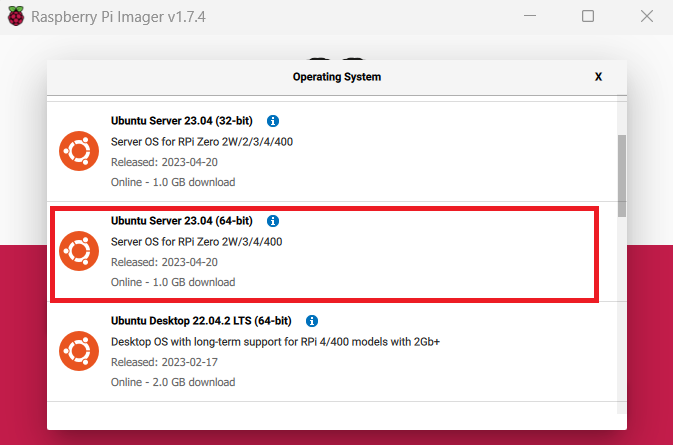
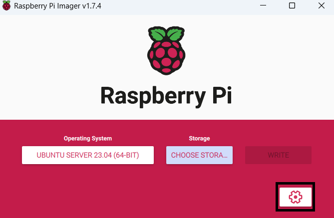
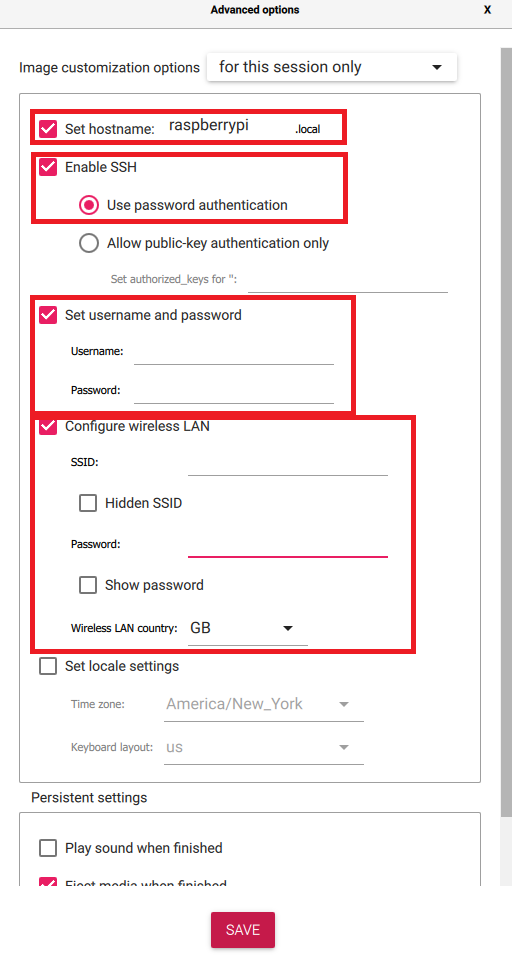

# minecraft-pi

A basic setup for a Minecraft server as a service on a headless Raspberry Pi.

The Raspberry Pi is maybe one of my favorite little devices because it truly is one of the most flexible platforms I have seen.  I really like these little things, but I always felt like I could not find the right resources to get everything set up in the way I wanted.  After finally cobbling together a bunch of different websites, I think I have finally landed on a setup that works well.  A big point for me is that I live in an area that is prone to power outages, so when my Pi comes back online I wanted my server to automatically restart as well.  Unfortunately, resources were a bit thin in this area so hopefully this guide fills that gap.  If you have any recommendations, feel free to reach out!

## Basics

This guide will help you set up a vanilla[^1] Minecraft server with plugins as a Linux service all from the command line.  This has several benefits, including automatic restarts, the ability for better resource management, and some security benefits.  We will go through setting up your Pi, what to download, and a brief discussion of plugins.  Note that I am using a Pi 4 with 8 GB of RAM.  While this guide should work for other models, keep in mind that for a Minecraft server the availability of compute resources are critical.  

Translation, more RAM = better.  

[^1]: Technically it isn't actually vanilla because it's using PaperMC, but the point is that there are no mods.  

> **Disclaimer:**  I am not a Linux expert.  While I do have quite a bit of experience with Linux that I hope to pass along to you, most of this is my own knowledge that I have collected together rather than something professional.  Running a Minecraft server comes with risks and it is important to understand that at the end of the day, you are effectively letting other people play on your computer.  Some of the tips here will help make your Pi a bit more secure (and in fact this guide does not use port forwarding), but just keep in mind that this is really for playing with your friends, and that you should probably look into something professional for an openly public server.  

## Prerequisites

This guide assumes the following:
- You have physical access to your Raspberry Pi
- You have a second computer that can remotely access your Pi (we will talk about the actual setup but you do need a second device)
- You are familiar with basic navigation on the Linux command line
- You are familiar with how a Raspberry Pi basically works

Remember, this guide is to setup a headless Raspberry Pi, there is no desktop or GUI!  The reason for this is twofold.  First, it means you can stick your Pi in a closet or something and you don't have to worry about it.  Second, a GUI takes up resources and remember, we want to make as much available for the server as possible (especially on smaller devices).

## Setup your Raspberry Pi

Let's finally get into it!  This section will walk you through installing an OS, connecting to your Pi, some basic OS configuration, and installing Java.  The majority of these instructions are sourced from here: https://ubuntu.com/tutorials/how-to-install-ubuntu-on-your-raspberry-pi

1. For this guide, we are going to install Ubuntu Server.  You can use other operating systems, but I like this one.  Start by downloading the official Raspberry Pi imager from here: https://www.raspberrypi.com/software/.  

2. Open the software and hit Choose OS.  Select "Other general-purpose OS" and then Ubuntu.  Scroll down and select the newest version of Ubuntu Server (64-bit).  At time of writing, it is 23.04.  Note that while most other OS's will work, you must have a 64-bit OS if you have a Pi with 8 GBs of RAM, otherwise you will only be able to use 4 of your 8 GBs.  

   

3. Insert your Raspberry Pi's SD card into your computer.  Back on the main menu of the imager, select the "Choose Storage" button.  Your SD card should appear here.  Select it.  

> **Warning:** Make sure you are selecting the right storage drive as any data on it WILL BE WIPED.  While the official imager is smart enough to not list your computer's main drive, it is not smart enough to figure out which external drive you want to use.  Frankly, for extra safety I would just unplug any external drives except for your SD card until you are done, just to be sure you are overwritting the right drive.

4. Hit the little cog on the main menu of the imager. 

   

   We are going to be making several changes in the window that appears to make our lives easier.  First, select the checkmark in the first row for "Set hostname".  This is how your Raspberry Pi will be identified on your local network.  You can set the name to anything you like!

   Next, select the "Enable SSH" checkbox to turn it on.  This is how we are going to remotely log into our Pi without a screen.  Make sure that the radio button next to "Use password authentication" is selected.  
   
   Next section down, check the "Set username and password" box is selected.  Go ahead and set a username and password, any you'd like.  This is what we will be using to log into the Pi.  General advice applies, make sure your password is strong and hard to guess.  

   Finally, select the "Configure wireless LAN" checkbox.  This section should be autoconfigured with the information from your computer, but if not, go ahead and add the details of the wifi network that you want your Raspberry Pi to join.  You can skip this section if you are using an ethernet cable.  Your options should look like this (note that I have removed any personal information):

   

5. Hit Save at the bottom of the options screen and then hit "Write" back on the main menu of the imager.  This will begin writing Ubuntu Server with the options we specified to the SD card.  When it is done, put the SD card back into your Pi and plug it in.  Wait about 2-5 minutes for it to install and boot.  

6. Time to login! We will use SSH to remotely access our Pi.  Open a terminal and SSH using the following command:
   ```shell
   ssh <username>@<hostname or IP>

   # For example, if your username was foo and your Pi's hostname was minepi, the command would bekkjhkhkjhkjhkhkjhkjhkjhkjhkjhkjhkjhkjhkjhkjhkj:
   ssh foo@minepi
   ```
   Where username and hostname are what you set in step 4.  Now here's the thing.  Sometimes, you won't be able to reach the Pi via its hostname.  This could be for a variety of reasons, and may change once your Pi has been running for a bit.  Regardless, if you cannot login via hostname, try using the actual IP address of your Pi.  There are many ways to do this, for example you could login to your router's management interface and look there.  I usually use the Fing app you can get on your phone, which will scan all the devices on your network.  Just look for the entry that is your Pi and you will have your IP.  

   Once you successfully connect, say yes to the fingerprinting question.  Then you will be prompted for a password.  Enter the password you set in step 4.  Remember, on Unix machines, typing a password in the terminal will not make anything actually appear.  You are typing though.  If everything worked, you should now be in your Pi!

